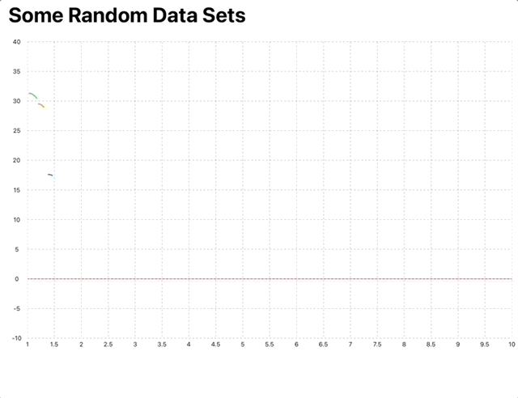
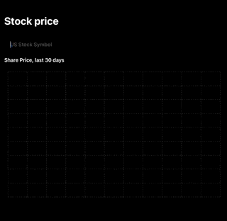
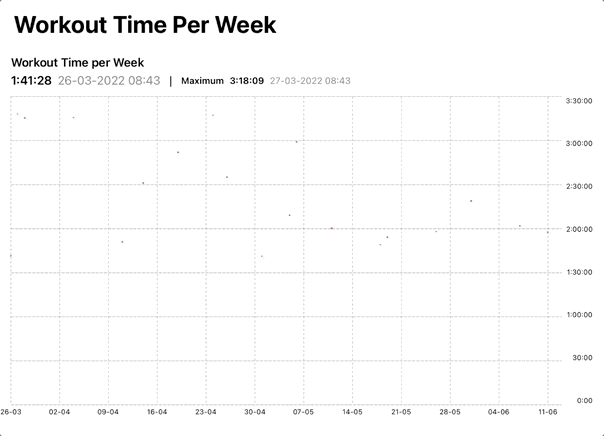
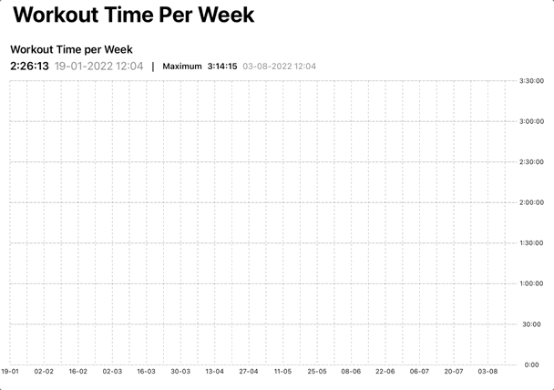
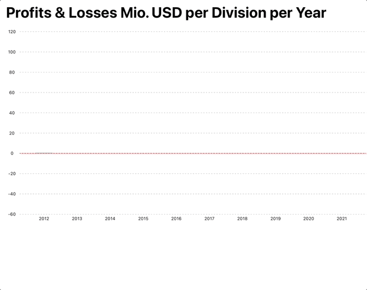
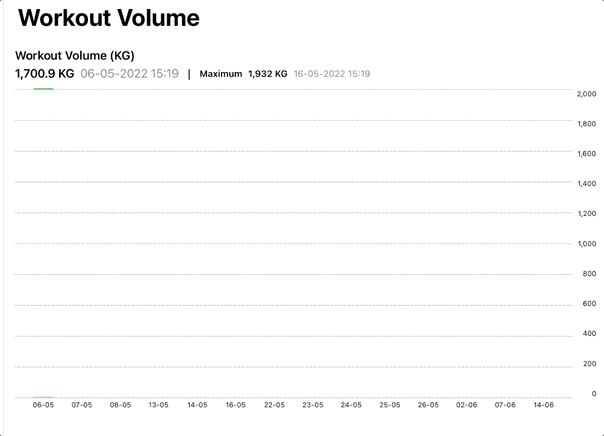
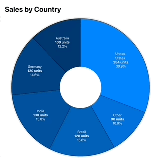

# SwiftUIGraphs


SwiftUIGraphs is a simple Swift package for iOS and iPadOS 14.0 and later. It features a line chart, bar chart and pie chart for data visualization and has many customization options. 
 

## Feature Overview


* **NEW**: from v1.0 DYLineChartView and DYBarChartView support muliple data series by default (multi-line and stacked bar charts).
* Create an interactive line chart with a moving data selector point. The package also allows setting separate data point colors and line section colors.
* Create an area chart by adding a gradient area below the line chart.
* Create a bar chart with an appear-animation and various customization options. 
* Create a pie chart or doughnut chart with customizable colors and a cool pop out effect to present a detail pie chart.
* The chart views feature separate header / info / legend views that can be replaced by custom solutions easily. 
* Add drop shadows to the line chart, gradient, bars and selected pie slice.
* Many more features - check out details below. 

The folder SwiftUIGraphsExample contains an example project, make sure to check it out for more implementation details. All public structs / classes include in-code-documentation.
    
    
## Installation


Installation through the Swift Package Manager (SPM) is recommended. 

SPM:
Select your project (not the target) and then select the Swift Packages tab. Clicking + and typing SwiftUIGraphs should find the package on github. Otherwise copy and paste the URL of this repo.


Check out the version history below for the current version.


Make sure to import SwiftUIGraphs in every file where you use SwiftUIGraphs. 

```Swift
    import SwiftUIGraphs
```

## Usage

Check out the following examples. This repo also contains an example project to illustrate how to implement all three chart types. Check the in-code documentation for more details.


### Line Charts

DYLineChartView supports the following modifiers:

* background(gradient...)
* selectorLine
* markerGridLine
* userInteraction
* showXAxis
* xAxisViewHeight
* xAxisGridLines
* xAxisLabelStringValue
* xAxisLabelFontSize
* xAxisScalerOverride
* showYaxis
* yAxisPosition
* yAxisViewWidth
* yAxisGridLines
* yAxisLabelStringValue
* yAxisLabelFontSize
* yAxisScalerOverride

Pass in one or several DYLineViews into DYLineChartView's lineViews closure. You can attach the following modifiers to DYLineView:

* lineStyle
* animation
* userInteraction
* area
* selectedPointIndicatorLineStyle
* colorPerLineSegment

#### Code Example: Multi-line chart

 

```Swift

struct MultiLineChartExample: View {
    
    let colors: [Color] = [.blue, .orange, .green]
    @State private var dataPointArrays: Array<[DYDataPoint]> = []
    
    @State private var blueSelectedDataPoint: DYDataPoint?
    @State private var orangeSelectedDataPoint: DYDataPoint?
    @State private var greenSelectedDataPoint: DYDataPoint?

    var body: some View {
  
        GeometryReader { proxy in
            VStack {
                
                DYLineChartView(allDataPoints: Array(self.dataPointArrays.joined()), lineViews: { parentProps in
                    let selectedPoints = [$blueSelectedDataPoint, $orangeSelectedDataPoint, $greenSelectedDataPoint]
                    ForEach(0..<dataPointArrays.count, id:\.self) { i in
                        
                        DYLineView(dataPoints: dataPointArrays[i], selectedDataPoint: selectedPoints[i], pointView: { _ in
                            self.pointViewFor(index: i)
                        }, selectorView: self.selectorPointViewFor(index: i), parentViewProperties: parentProps)
                        .lineStyle(color: colors[i])
                        .selectedPointIndicatorLineStyle(xLineColor: colors[i], yLineColor: colors[i])
                         
                    }
              
                    
                })
                .markerGridLine(coordinate: 0, color: .red)
                .yAxisLabelFontSize(UIDevice.current.userInterfaceIdiom == .phone ? 8 : 10)
                .yAxisLabelStringValue({ yValue in
                    self.stringified(value:yValue)
                })
                .xAxisLabelFontSize(UIDevice.current.userInterfaceIdiom == .phone ? 8 : 10)
                .xAxisLabelStringValue({ xValue in
                    self.stringified(value: xValue)
                })
                .frame(height: self.chartHeight(proxy: proxy))
                .padding()

                self.legendView.padding()
                
                
                Spacer()
            }

        }.navigationTitle("Some Random Data Sets")
            .onAppear {
                generateDataPoints()
            }

    }
    
    func chartHeight(proxy: GeometryProxy)->CGFloat {
        return proxy.size.height > proxy.size.width ? proxy.size.height * 0.4 : proxy.size.height * 0.75
    }
    
    var legendView: some View {

        return HStack(spacing:15) {
            let selectedPoints = [blueSelectedDataPoint, orangeSelectedDataPoint, greenSelectedDataPoint]
            ForEach(0..<selectedPoints.count, id:\.self) { i in
                if let dataPoint =  selectedPoints[i] {
                    HStack {
                        self.pointViewFor(index: i)
                        Text("X: \(self.stringified(value: dataPoint.xValue))")
                        Text("Y: \(self.stringified(value: dataPoint.yValue))")
                        
                    }.font(UIDevice.current.userInterfaceIdiom == .pad ? .body : .caption)
                }
            }
            Spacer()
        }
    }
    
    func stringified(value: Double)->String {
        let formatter = NumberFormatter()
        formatter.maximumFractionDigits = 1
        return formatter.string(for: value)!
    }
    
    
    func generateDataPoints() {
        var dataPointArrays: Array<[DYDataPoint]> = []
        for _ in 0..<3 {
            
            var dataPoints: [DYDataPoint] = []
            var xValue = Double.random(in: 1...1.5)
            for _ in 0..<12 {
                
                let yValue = Double.random(in: -10...40)
                let dataPoint = DYDataPoint(xValue: xValue, yValue: yValue)
                dataPoints.append(dataPoint)
                xValue += Double.random(in: 0.5...1)
            }
            dataPointArrays.append(dataPoints)
        }
        self.dataPointArrays = dataPointArrays
    }
    

    
    func pointViewFor(index: Int)-> some View {
        Group {
            switch index {
                case 0:
                DYLinePointView(borderColor: colors[index])
           
                case 1:
                DYLinePointView(shape: Rectangle(), borderColor: colors[index], edgeLength: 10)
          
                default:
                DYLinePointView(shape: Triangle(), borderColor: colors[index])
                
            }
        }
    }
    
    func selectorPointViewFor(index: Int)-> some View {
        Group {
            switch index {
                case 0:
                DYSelectorPointView()
                case 1:
                DYSelectorPointView(shape: Rectangle(), shapeSize: 12, shapeHaloSize: 24)
                default:
                DYSelectorPointView(shape: Triangle(), haloOffset: CGSize(width: 0, height: -14 / 6))
                
            }
        }
    }

}
```

#### Other examples

Check out the example project for details (included in the package).

 

In order to try out the stock price example, you need to sign up with https://iexcloud.io for free to get an authentication token. 


**Area Chart with different color per line segment example**: 


 

Additionally, you can add a drop shadow underneath the gradient (and / or the line):

 


### Bar Charts

DYBarChartView supports multiple data series from version 1.0. Each bar is represented by a DYBarDataSet - check out the example below for details.

DYBarChartView supports the following modifiers:

* background(gradient: LinearGradient)
* userInteraction(enabled: Bool = true)
* barDropShadow(_ shadow: Shadow)
* labelViewOffset( _ offset: CGSize)
* selectedBar(borderColor: Color, dropShadow: Shadow? = nil)
* barLabelMinimumEdgeMargin(top: CGFloat = 0, bottom: CGFloat = 10)
* showXaxis(_ show: Bool)
* xAxisViewHeight(_ height: CGFloat)
* xAxisLabelFontSize(_ fontSize: CGFloat)
* showYaxis(_ show: Bool)
* yAxisPosition(_ position: Edge.Set)
* yAxisViewWidth(_ height: CGFloat)
* yAxisLabelStringValue(_ stringValue: @escaping (Double)->String)
* yAxisLabelFontSize(_ fontSize: CGFloat)
* yAxisGridLines(showGridLines: Bool = true, gridLineColor: Color = Color.secondary.opacity(0.5), gridLineStrokeStyle: StrokeStyle = StrokeStyle(lineWidth: 1, dash: [3]))
* markerGridLine(yCoordinate: Double, color: Color, strokeStyle: StrokeStyle = StrokeStyle(lineWidth: 1, dash: [3]))
* yAxisScalerOverride(minMax: (min:Double?, max:Double?)? = nil, interval: Double? = nil, maxTicks: Int = 10)


#### Code Example: Stacked Bar Chart

 


``` Swift 
struct MultiBarChartExample: View {
    
    let colors: [Color] = [.blue, .orange, .green]
    let titles = ["Energy", "Pharmaceutical", "Agriculture"]
    @State var barDataSets: [DYBarDataSet] = []
    @State var selectedBarDataSet: DYBarDataSet?
    
    var body: some View {
        GeometryReader { proxy in
            VStack {
                DYBarChartView(barDataSets: barDataSets, selectedBarDataSet: $selectedBarDataSet)
                .barDropShadow(Shadow(color: .gray, radius:8, x:-4, y:-3))
                .selectedBar(borderColor: .purple, dropShadow: Shadow(color: .black.opacity(0.7), radius:10, x:-7, y:-5))
                .yAxisLabelFontSize(UIDevice.current.userInterfaceIdiom == .phone ? 8 : 10)
                .markerGridLine(yCoordinate: 0, color: .red)
                .xAxisLabelFontSize(UIDevice.current.userInterfaceIdiom == .phone ? 8 : 10)
                .frame(height:chartHeight(proxy: proxy))
                
            
                if self.barDataSets.isEmpty == false {
                    HStack {
                        self.selectedDataSetDetailView()
                        Spacer()
                    }
                }
                
                Spacer()
            }.padding()

        }.navigationTitle("Profits & Losses Mio. USD per Division per Year")
            .onAppear {
                self.generateExampleData()
            }
    }

    
    func chartHeight(proxy: GeometryProxy)->CGFloat {
        return proxy.size.height > proxy.size.width ? proxy.size.height * 0.4 : proxy.size.height * 0.65
    }
    
    func selectedDataSetDetailView()->some View {
        Group {
            if let barDataSet = selectedBarDataSet {
                VStack(alignment: .leading) {
                    
                    Text(barDataSet.xAxisLabel).font(.callout).bold()
                    HStack {
                        if barDataSet.netValue >= 0 {
                            Text("Net Profit:")
                        } else {
                            Text("Net Loss:").foregroundColor(.red).bold()
                        }
                        Text(abs(barDataSet.netValue).toCurrencyString(maxDigits:1) + " million").foregroundColor(barDataSet.netValue >= 0 ? .primary : .red)
                        Spacer()
                    }
                    
                    VStack(spacing: 0) {
                        ForEach(0..<barDataSet.fractions.count, id:\.self) { i in
                            let fraction = barDataSet.fractions[i]
                            HStack(spacing: 0) {
                                HStack {
                                    Rectangle().fill(colors[i]).frame(width: 15, height: 15)
                                    Text(fraction.title + ": ")
                                    Spacer()
                                }
                                
                                Text(fraction.value.toCurrencyString(maxDigits:1) + " million").foregroundColor(fraction.value >= 0 ? .primary : .red)
                                Spacer()
                            }.font(.callout)
                            
                        }

                    }.transition(AnyTransition.opacity)
                    
                    
                }.frame(maxWidth: 300).padding()
 
            }
        }
    }
    
    
    func generateExampleData() {
        var barDataSets: [DYBarDataSet] = []
        var currentYear = 2012
        
        for _ in 0..<10 {
            let firstValue = Double.random(in: -10 ..< 50)
            let secondValue = Double.random(in: -20 ..< 40)
            let thirdValue = Double.random(in: -30 ..< 30)
            let values = [firstValue, secondValue, thirdValue]
            let xValueLabel = "\(currentYear)"
            var fractions: [DYBarDataFraction] = []
            for i in 0..<values.count {
                let fraction = DYBarDataFraction(value: values[i], title:titles[i], gradient: LinearGradient(colors: [colors[i]], startPoint: .top, endPoint: .bottom)) {
                    Text(values[i].toDecimalString(maxFractionDigits: 1)).font(.footnote).lineLimit(1).foregroundColor(.white).eraseToAnyView()
                }
                fractions.append(fraction)
            }
            
            let dataSet = DYBarDataSet(fractions: fractions, xAxisLabel: xValueLabel, labelView: { value in
                let text = value != 0 ? value.toDecimalString(maxFractionDigits: 1) : ""
                return Text(text).font(.footnote).eraseToAnyView()
            })
            barDataSets.append(dataSet)

            currentYear += 1
        }
        self.barDataSets = barDataSets
    }
}

```

***Simple bar chart example:***

 

### Pie Charts

DYPieChartView supports the following modifiers:

*  innerCircleRadiusFraction(_ fraction: CGFloat)
*  userInteraction(enabled: Bool)
*  sliceBorderLine(width: CGFloat = 1, color: Color = .primary)
*  selectedSlice(scaleEffect: CGFloat = 1.05, dropShadow: Shadow = Shadow(color: .gray.opacity(0.7), radius: 10, x: 0, y: 0))
*  minimumFractionForSliceLabelOffset(_ fraction: CGFloat = 0.1)
*  hideMultiFractionSliceOnSelection(_ hide: Bool = false)


#### Code example: Ring Chart with detail pie chart (pop-out effect)

Set the innerCircleRadiusFraction(_ fraction: CGFloat = 0) modifier to a value larger than 0 and smaller than 1 to turn a pie chart into a ring chart. Details below. 

 

```Swift

struct RingChartAndDetailPieChartExample: View {

    @State var detailChartSelectedSlice: DYPieFraction?
    @State private var pieScale:CGSize = .zero
    @StateObject var chartModel: ChartModel = ChartModel()
    @Namespace var animationNamespace
    
    
    var body: some View {
        GeometryReader { proxy in
            if proxy.size.height > proxy.size.width {
                VStack {
                    self.contentView(isPortrait: true)
                }
            } else {
                HStack {
                    self.contentView(isPortrait: false)
                }
            }
        }.navigationTitle("Sales by Country")
    }
    
    func contentView(isPortrait: Bool)-> some View {
        Group {
            self.mainPieChart(isPortrait: isPortrait)

            if detailChartVisibleCondition {
                self.otherCategoryDetailsPieChart()
            }
        }
    }
    
    func mainPieChart(isPortrait: Bool)->some View {
        VStack(spacing: 10) {
            DYPieChartView(data: chartModel.data, selectedSlice: $chartModel.selectedSlice, sliceLabelView: { (fraction)  in
                self.sliceLabelContentView(fraction: fraction, data:self.chartModel.data, textColor: .white)
            }, animationNamespace: animationNamespace)
            .hideMultiFractionSliceOnSelection(true)
            .innerCircleRadiusFraction(0.3)
            .background(Circle().fill(Color(.systemBackground)).shadow(color: detailChartVisibleCondition ? .clear : .gray, radius:5))
            .rotationEffect(detailChartVisibleCondition ? Angle(degrees: isPortrait ? 45 : -40) : Angle(degrees: 0))

        }
        .scaleEffect(self.pieScale)
        .padding()
        .onAppear {
            withAnimation(.spring()) {
                self.pieScale = CGSize(width: 1, height: 1)
            }
        }
        

    }
    
    func otherCategoryDetailsPieChart()->some View {
        VStack(spacing: 5) {
            DYPieChartView(data: chartModel.data[1].detailFractions, selectedSlice: $detailChartSelectedSlice, sliceLabelView: { (fraction) in
                self.detailChartSliceLabelView(fraction: fraction, data: chartModel.data[1].detailFractions)
   
            }, animationNamespace: animationNamespace)
            .minimumFractionForSliceLabelOffset(0.11)
            .background(Circle().fill(Color(.systemBackground)).shadow(radius: 10))
            .padding(50)
            .matchedGeometryEffect(id: self.chartModel.data[1].id, in: self.animationNamespace)

        }
    }
    

    
    func detailChartSliceLabelView(fraction: DYPieFraction, data: [DYPieFraction])->some View {
        Group {
            if fraction.value / data.reduce(0, { $0 + $1.value}) >= 0.11 || self.detailChartSelectedSlice == fraction {
                self.sliceLabelContentView(fraction: fraction, data:data, textColor: fraction.value / data.reduce(0, { $0 + $1.value}) >= 0.11 ? .white : .primary)
            }
        }
    }
    
    func sliceLabelContentView(fraction: DYPieFraction, data:[DYPieFraction], textColor: Color)-> some View {
        VStack {
            Text(fraction.title).font(sliceLabelViewFont).lineLimit(2).frame(maxWidth: 85)
            Text(String(format:"%.0f units", fraction.value)).font(sliceLabelViewFont).bold()
            Text(fraction.value.percentageString(totalValue: data.reduce(0) { $0 + $1.value})).font(sliceLabelViewFont)
            
        }.foregroundColor(textColor)
    }
    
    var sliceLabelViewFont: Font {
       return UIDevice.current.userInterfaceIdiom == .pad ? .callout : .caption
    }
    
    var detailChartVisibleCondition: Bool {
        self.chartModel.selectedSlice == chartModel.data[1]
    }
}
```

## References & special thanks

- DYLineChartView was inspired by [this great tutorial](https://trailingclosure.com/recreating-the-strava-activity-graph/) by Jean-Marc Boullianne on how to implement the Strava line chart. DYLineChart however is a generic implementation of a line chart and not limited to 12 weeks running workout data. 
- Special thanks to Roman Baitaliuk for his implementation of a "nice number" algorithm for the y-axis. This algorithm can be found elsewhere but apparently not in Swift
- Special thanks to xspyhack for the implementation of a SwiftUI Path and CGPoint extensions. 
- Special thanks to David Malan and his team of Harvard's CS50 Introduction to Computer Science. There is no better course to learn programming basics. 

## Change log

#### [Version 1.0.1](https://github.com/DominikButz/SwiftUIGraphs/releases/tag/1.0.1)
BREAKING changes:

* DYLineChartView and DYBarChartView now support multiple data series by default.
* no more bulky settings objects to pass into the initialisers: simply attach modifiers. 
* no more chart height parameter in the initialisers: simply attach a .frame modifier like with any other SwiftUI view.
* DYLineChartView x-axis ticks are now calculated in the same way as the y-axis. In order to override the min and max x-axis values as well as the tick interval, simply attach the xAxisScalerOverride modifier (for the y-axis, attach the yAxisScalerOverride modifier).
* use the markerGridLine-modifier to add one or several marker lines (e.g. as target line) to the plot area.

#### [Version 0.9.3](https://github.com/DominikButz/SwiftUIGraphs/releases/tag/0.9.3)
Bug fix: in the line chart, user interaction (provided it is switched on) works again if showAppearAnimation set to false

#### [Version 0.9.2](https://github.com/DominikButz/SwiftUIGraphs/releases/tag/0.9.2)
Added showAppearAnimation parameter to settings of DYLineChartView and DYBarChartView. If it is set to false, the line, line gradient (if any) and the bars will appear instantly without any transition animation.

#### [Version 0.9.1](https://github.com/DominikButz/SwiftUIGraphs/releases/tag/0.9.1)
Bug fixes: 

* DYBarChart yAxis labels are now positioned more precisely
* lateral padding works correctly in DYBarChartView
* bars won't surpass the bounds of the chart area any more when device orientation is changed.
* DYPieChart: if the sum of detailFractions' values is not equal to the parent chart fraction value, an assertionFailure is thrown.

#### [Version 0.9](https://github.com/DominikButz/SwiftUIGraphs/releases/tag/0.9)
"Shady update": You can now set drop shadows to show underneath the line and line gradient and underneath each bar and pie chart slice.
Moreover, in the DYGridChartHeaderView you can now set the selected y-value text label to a different text color. 
Bug fixes:

* lateral padding should work properly now and should not shift subviews any more.
* the y-axis labels are now positioned more precisely.

#### [Version 0.8.2](https://github.com/DominikButz/SwiftUIGraphs/releases/tag/0.8.2)
Added allowUserInteration parameter to all three chart type settings (default is true).

#### [Version 0.8.1](https://github.com/DominikButz/SwiftUIGraphs/releases/tag/0.8.1)
Added lineAnimationDuration property to DYLineChartSettings. 

#### [Version 0.8](https://github.com/DominikButz/SwiftUIGraphs/releases/tag/0.8)
* added labelView paramenter (closure) to DYLineChartView and DYBarChartView initialisers to display custom label views above data points / bars if required.
* added (optional) additional grid line properties to x-axis and y-axis settings (currently for DYLineChartView only). 

#### [Version 0.7.2](https://github.com/DominikButz/SwiftUIGraphs/releases/tag/0.7.2)
  Added DYLineChartSettings property that allows switching the interpolation type for path drawing between points to linear instead of quadCurve. 
  
#### [Version 0.7.1](https://github.com/DominikButz/SwiftUIGraphs/releases/tag/0.7.1)
* A segmented line with several color-segments now appears with a continuous draw-style animation from left to right.
* Added selectedBarGradient property to DYBarSettings. Setting this value will apply a separate linear gradient to the selected bar.
* Code optimisation

#### [Version 0.7](https://github.com/DominikButz/SwiftUIGraphs/releases/tag/0.7)
It is now possible to set individual colors per data point and per line section using closures in the initialiser of DYLineChartView. Additionally, it is possible to set a different color per each bar in the DYBarChartView initialiser. Special thanks to SAleksiev for his suggestion and help. 

#### [Version 0.6.1](https://github.com/DominikButz/SwiftUIGraphs/releases/tag/0.6.1)
Initial public release. Added documentation to all public struct and class initializers. Minor visual improvements.


## Author

dominikbutz@gmail.com

## License

SwiftUIGraphs is available under the MIT license. See the LICENSE file for more info.

