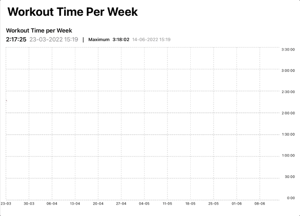

# SwiftUIGraphs


SwiftUIGraphs is a simple Swift package for iOS and iPadOS 14.0 and later. It features a line chart, bar chart and pie chart for data visualization and has many customization options. 
 

## Feature Overview

* Create an interactive line chart and customize the visuals: gradient below the line, x-axis, y-axis. The package also allows setting separate data point colors and line section colors.
* Create a bar chart with an appear-animation and various customization options. 
* Create a pie chart or doughnut chart with customizable colors and a cool pop out effect to present a detail pie chart.
* The chart views feature separate header / info views that can be replaced by custom solutions easily. The pie chart additionallly features a legend view that can be replaced easily. 
* Add drop shadows to the line chart, gradient, bars and selected pie slice.

Check out the examples below for details. The folder SwiftUIGraphsExample contains an example project, make sure to check it out for more implementation details. All public structs / classes include in-code-documentation.
    
    
## Installation


Installation through the Swift Package Manager (SPM) is recommended. 

SPM:
Select your project (not the target) and then select the Swift Packages tab. Clicking + and typing SwiftUIGraphs should find the package on github. Otherwise copy and paste the URL of this repo.


Check out the version history below for the current version.


Make sure to import SwiftUIGraphs in every file where you use SwiftUIGraphs. 

```Swift
    import SwiftUIGraphs
```

## Usage

Check out the following examples. This repo also contains an example project to illustrate how to implement all three chart types. Check the in-code documentation for more details.


### Code example: Line Chart

In order to try out the stock price example, you need to sign up with https://iexcloud.io for free to get an authentication token. 

 

```Swift

struct LineChartWithAsyncDataFetch: View {
    //TODO: sign up with https://iexcloud.io to get a free auth token and insert it here
    @StateObject var viewModel = StockPriceDataViewModel(token: "")
    
    var body: some View {
        GeometryReader { proxy in
            Group {
                    VStack {
                        TextField("US Stock Symbol", text: $viewModel.stockSymbol, onCommit: {
                            viewModel.loadDataPoints()
                        }).textFieldStyle(RoundedBorderTextFieldStyle()).font(.headline).foregroundColor(.orange).padding()
                        
                        DYGridChartHeaderView(title: "\(self.viewModel.stockSymbol) Share Price, last 30 days", dataPoints: self.viewModel.dataPoints, selectedIndex: self.$viewModel.selectedIndex, isLandscape: proxy.size.height < proxy.size.width, xValueConverter: { (xValue) -> String in
                        return Date(timeIntervalSinceReferenceDate: xValue).toString(format:"dd-MM-yyyy")
                    }, yValueConverter: { (yValue) -> String in
                        
                        return  yValue.toCurrencyString(maxDigits: 2)
                        
                    })
                    
                    DYLineChartView(dataPoints: self.viewModel.dataPoints, selectedIndex: self.$viewModel.selectedIndex, xValueConverter: { (xValue) -> String in
                        // this is for the x-Axis values - date should be short
                        return Date(timeIntervalSinceReferenceDate: xValue).toString(format:"dd-MM")
                    }, yValueConverter: { (yValue) -> String in
                        // return without currency symbol
                        let formatter = NumberFormatter()
                        formatter.maximumFractionDigits = 2
                        return formatter.string(for: yValue)!
                        //  return TimeInterval(yValue).toString() ?? ""
                    }, chartFrameHeight: proxy.size.height > proxy.size.width ? proxy.size.height * 0.4 : proxy.size.height * 0.65,  settings: DYLineChartSettings(showPointMarkers: true, lateralPadding: (0, 0), yAxisSettings: YAxisSettings(yAxisFontSize: fontSize), xAxisSettings: DYLineChartXAxisSettings(showXAxis: true, xAxisInterval: 172800, xAxisFontSize: fontSize)))  //seconds per 48 hours
                    Spacer()
                }.padding()
            }
        }.navigationTitle("Stock price")

    }
    
    var fontSize: CGFloat {
        UIDevice.current.userInterfaceIdiom == .phone ? 8 : 10
    }
    var yAxisWidth: CGFloat {
        UIDevice.current.userInterfaceIdiom == .phone ? 35 : 45
    }
}

```
In the initialiser you can set the colorPerPoint (+ diameterPerPoint, strokeStylePerPoint, backgroundColorPerPoint) and/or colorPerLineSegment to override the values in the DYLineChartSettings.
Example:

 

Additionally, you can add a drop shadow underneath the gradient (and / or the line):

 


### Code example: Bar Chart

 

You can set a different linear color gradient for the selected bar. Moreover, you can add a drop shadow underneath the bars (and a separate shadow for the selected bar if required). Check out the following example. 

``` Swift 

    @State var selectedDataIndex: Int = 0
    let exampleData = DYDataPoint.exampleData1
    
    var body: some View {
       
        GeometryReader { proxy in
            VStack {
                DYGridChartHeaderView(title: "Workout Volume (KG)", dataPoints: exampleData, selectedIndex: self.$selectedDataIndex, selectedYValueTextColor: Color.green, isLandscape: proxy.size.height < proxy.size.width, xValueConverter: { (xValue) -> String in
                    return Date(timeIntervalSinceReferenceDate: xValue).toString(format:"dd-MM-yyyy HH:mm")
                }, yValueConverter: { (yValue) -> String in
                    return  yValue.toDecimalString(maxFractionDigits: 1) + " KG"
                })
                
                DYBarChartView(dataPoints: exampleData, selectedIndex: $selectedDataIndex, labelView: nil, xValueConverter: { (xValue) -> String in
                    return Date(timeIntervalSinceReferenceDate: xValue).toString(format:"dd-MM")
                }, yValueConverter: { (yValue) -> String in
                    return  yValue.toDecimalString(maxFractionDigits: 0)
                }, chartFrameHeight: proxy.size.height > proxy.size.width ? proxy.size.height * 0.4 : proxy.size.height * 0.65, settings: DYBarChartSettings(selectedBarGradient: LinearGradient(colors: [.green, .green.opacity(0.8)], startPoint: .top, endPoint: .bottom), barDropShadow: self.dropShadow, showSelectionIndicator: false, selectionIndicatorColor: .green, yAxisSettings: YAxisSettings(yAxisPosition: .trailing,  yAxisFontSize: fontSize, yAxisMinMaxOverride: (min:0, max:nil)), xAxisSettings: DYBarChartXAxisSettings(showXAxis: true, xAxisFontSize: fontSize)))
                
                Spacer()
            }.padding()
            .navigationTitle("Workout Volume")
        }
    }
    
    var fontSize: CGFloat {
        UIDevice.current.userInterfaceIdiom == .phone ? 8 : 10
    }
    
    var dropShadow: Shadow {
       return Shadow(color: .gray, radius:8, x:-4, y:-3)
    }
    
    func labelView(dataPoint: DYDataPoint)-> AnyView {
        
        return Text("Text").font(.caption).foregroundColor(.blue).eraseToAnyView()
    }

    
}
```

You can override the bar color gradient by setting the gradientPerBar closure in the initialiser (default value is nil).
In order to apply a different color gradient to the selected bar, set the selectedBarGradient property in the DYBarSettings struct. 

### Code example: Ring Chart with detail pie chart (pop-out effect)

 

```Swift
struct RingChartAndDetailPieChartExample: View {

    @State var detailChartSelectedId: String?
    @StateObject var chartModel: ChartModel = ChartModel()
    @Namespace var animationNamespace
    
    var body: some View {
        GeometryReader { proxy in
            if proxy.size.height > proxy.size.width {
                VStack {
                    self.contentView(isPortrait: true)
                }
            } else {
                HStack {
                    self.contentView(isPortrait: false)
                }
            }
        }.navigationTitle("Sales by Country")
    }
    
    func contentView(isPortrait: Bool)-> some View {
        Group {
            self.mainPieChart(isPortrait: isPortrait)
            
            if detailChartVisibleCondition {
                self.otherCategoryDetailsPieChart()
            }
        }
    }
    
    func mainPieChart(isPortrait: Bool)->some View {
        VStack(spacing: 10) {
            DYPieChartView(data: chartModel.data, selectedId: $chartModel.selectedId, sliceLabelView: { (fraction)  in
                self.sliceLabelContentView(fraction: fraction, data:self.chartModel.data, textColor: .white)
            }, shouldHideMultiFractionSliceOnSelection: true, animationNamespace: animationNamespace, settings: DYPieChartSettings(innerCircleRadiusFraction: 0.3))
            .background(Circle().fill(Color(.systemBackground)).shadow(color: detailChartVisibleCondition ? .clear : .gray, radius:5))
            .rotationEffect(detailChartVisibleCondition ? Angle(degrees: isPortrait ? 45 : -40) : Angle(degrees: 0))

        }.padding()

    }
    
    func otherCategoryDetailsPieChart()->some View {
        VStack(spacing: 5) {
            DYPieChartView(data: chartModel.data[1].detailFractions, selectedId: $detailChartSelectedId, sliceLabelView: { (fraction) in
                self.detailChartSliceLabelView(fraction: fraction, data: chartModel.data[1].detailFractions)
   
            }, animationNamespace: animationNamespace, settings: DYPieChartSettings(minimumFractionForSliceLabelOffset: 0.11))
            .background(Circle().fill(Color(.systemBackground)).shadow(radius: 10))
            .padding(50)
            .matchedGeometryEffect(id: self.chartModel.data[1].id, in: self.animationNamespace)

        }
    }
    

    
    func detailChartSliceLabelView(fraction: DYChartFraction, data: [DYChartFraction])->some View {
        Group {
            if fraction.value / data.reduce(0, { $0 + $1.value}) >= 0.11 || self.detailChartSelectedId == fraction.id {
                self.sliceLabelContentView(fraction: fraction, data:data, textColor: fraction.value / data.reduce(0, { $0 + $1.value}) >= 0.11 ? .white : .primary)
            }
        }
    }
    
    func sliceLabelContentView(fraction: DYChartFraction, data:[DYChartFraction], textColor: Color)-> some View {
        VStack {
            Text(fraction.title).font(sliceLabelViewFont).lineLimit(2).frame(maxWidth: 85)
            Text(String(format:"%.0f units", fraction.value)).font(sliceLabelViewFont).bold()
            Text(fraction.value.percentageString(totalValue: data.reduce(0) { $0 + $1.value})).font(sliceLabelViewFont)
            
        }.foregroundColor(textColor)
    }
    
    var sliceLabelViewFont: Font {
       return UIDevice.current.userInterfaceIdiom == .pad ? .callout : .caption
    }
    
    var detailChartVisibleCondition: Bool {
        self.chartModel.selectedId == chartModel.data[1].id
    }
}

```
## References & special thanks

- DYLineChartView was inspired by [this great tutorial](https://trailingclosure.com/recreating-the-strava-activity-graph/) by Jean-Marc Boullianne on how to implement the Strava line chart. DYLineChart however is a generic implementation of a line chart and not limited to 12 weeks running workout data. 
- Special thanks to Roman Baitaliuk for his implementation of a "nice number" algorithm for the y-axis. This algorithm can be found elsewhere but apparently not in Swift
- Special thanks to xspyhack for the implementation of a SwiftUI Path and CGPoint extensions. 
- Special thanks to David Malan and his team of Harvard's CS50 Introduction to Computer Science. There is no better course to learn programming basics. 

## Change log

#### [Version 0.9](https://github.com/DominikButz/SwiftUIGraphs/releases/tag/0.9)
"Shady update": You can now set drop shadows to show underneath the line and line gradient and underneath each bar and pie chart slice.
Moreover, in the DYGridChartHeaderView you can now set the selected y-value text label to a different text color. 
Bug fixes:
- lateral padding should work properly now and should not shift subviews any more.
- the y-axis labels are now positioned more precisely.

#### [Version 0.8.2](https://github.com/DominikButz/SwiftUIGraphs/releases/tag/0.8.2)
Added allowUserInteration parameter to all three chart type settings (default is true).

#### [Version 0.8.1](https://github.com/DominikButz/SwiftUIGraphs/releases/tag/0.8.1)
Added lineAnimationDuration property to DYLineChartSettings. 

#### [Version 0.8](https://github.com/DominikButz/SwiftUIGraphs/releases/tag/0.8)
- added labelView paramenter (closure) to DYLineChartView and DYBarChartView initialisers to display custom label views above data points / bars if required.
- added (optional) additional grid line properties to x-axis and y-axis settings (currently for DYLineChartView only). 

#### [Version 0.7.2](https://github.com/DominikButz/SwiftUIGraphs/releases/tag/0.7.2)
  Added DYLineChartSettings property that allows switching the interpolation type for path drawing between points to linear instead of quadCurve. 
  
#### [Version 0.7.1](https://github.com/DominikButz/SwiftUIGraphs/releases/tag/0.7.1)
- A segmented line with several color-segments now appears with a continuous draw-style animation from left to right.
- Added selectedBarGradient property to DYBarSettings. Setting this value will apply a separate linear gradient to the selected bar.
- Code optimisation

#### [Version 0.7](https://github.com/DominikButz/SwiftUIGraphs/releases/tag/0.7)
It is now possible to set individual colors per data point and per line section using closures in the initialiser of DYLineChartView. Additionally, it is possible to set a different color per each bar in the DYBarChartView initialiser. Special thanks to SAleksiev for his suggestion and help. 

#### [Version 0.6.1](https://github.com/DominikButz/SwiftUIGraphs/releases/tag/0.6.1)
Initial public release. Added documentation to all public struct and class initializers. Minor visual improvements.


## Author

dominikbutz@gmail.com

## License

SwiftUIGraphs is available under the MIT license. See the LICENSE file for more info.

